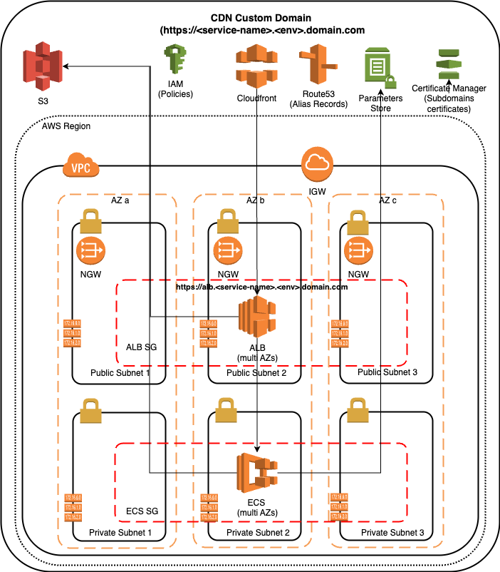

# AWS ECS Fargate - Terraform module

This Terraform module creates infrastructure for a public exposed application running on AWS ECS cluster using fargate deploy.
It creates a CloudFront distribution with a Custom domain and allow only encrypted traffic between both the clients and the CF distribution and the distribution and its ALB origin.

Deployed resources
-----------------------

The module creates the following resources:



- **VPC**: by default the module creates a vpc in the provided region (default value *eu-central-1*) using the CIDR *192.168.0.0/16*. You can optionally override the CIDR using the variable *vpc_cidr*
  - **Subnets**: the module creates one public subnet and one private subnet for each AZ in the provided region
  - **Internet Gateway**: an Internet Gateway is attached to the VPC
  - **NAT Gateway**: the module deploy a Nat Gateway in each created public subnets
  - **Route Tables**: router tables are created in order to manage both the local traffic and the Internet traffic for both Private (Nat GW) and Public Subnets (IGW)
- **ECS Cluster**: an ECS Cluster Multi-AZ in created in the public subnets. 
  - **ECS Tasks and Service**: ECS resources are created in order to deploy the provided image 
  - **ECS Security Group**: a security group is created and assigned to the ECS Service in order to allow the traffic only from the ALB
- **Secret string in Parameter Store**: a secret string used from the deploted node-js app
- **Application Load Balancer**: an Multi-Az ALB is deployed in the public subnets. 
  - **ALB Listeners**: the ALB is configured with the following rules:
    - Cloudfront sends a Custom Header that contains a header with a pre-defined key. ALB deny access with an error 403 if the key doesn’t match. Otherwise it forward the request the ECS Service instances
    - Redirect rule from port HTTP:80 to HTTPS:443
  - **ALB Security Group**: it only accepts connections from the CloudFront on port 443
  - **ALB Custom Subdomain**: in order to configure the HTTPS Listener, the module:
    - create a CNAME record in Route53 for the provided Public Hosted *zone_id* (domain alb-*<service-name>*.*<environment>*.*<yourprovideddomain.something>*)
    - create a certifate using AWS Certificate Manager for the created subdomain
- **Cloudfront**: this module create a CloudFront distribution and assign it a custom domain (*<service-name>*.*<environment>*.*<yourprovideddomain.something>*). The custom domain accepts from the clients only HTTPS connections and all the traffic forwarded to the ALB is encrypted
- **S3 Bucket for logs**: an S3 Bucket is created to store the ALB and Clouffront logs
- **IAM Policies**: the module creates and assign the IAM policies needed to grant Cloudfront and the ALB to delivery the log in the Bucket

Terraform version
-----------------

Require terraform version >= 1.9.5

External Module Dependencies
-------------------

None

Provider Dependencies
---------------------

aws (hashicorp/aws) ~> 5.0 as minimum

Module Input Variables
----------------------

| Variable              | Type | Required | Default | Description|
| :---------------- | :------: |:------: | ----: | ----:
| service_name |  string | Yes | - | The name of the service
| environment | string  | Yes | - | The environment (e.g., dev, staging, prod)
| cdn_secret_header | string | Yes | - | Predefined Key for the CDN secret header
| app_secret_parameter | string | Yes | - | Secret String used from the nodejs App (cillu/nodejs-app:1.0.0)
| zone_id | string | Yes | - | Route53 zone ID (used to create the custome domain for CF and ALB)
| aws_region | string | No | eu-central-1 | The target AWS region
| vpc_cidr | string  | No | 192.168.0.0/16 | The CIDR block for the VPC
| app_image |  string | No | cillu/nodejs-app:1.0.0 | The deployed application image (on DockerHub)
| app_port | number | No | 3000 | The deployed application port
| app_fargate_cpu |  string | No | 256 | The amount of Fargate CPU to use
| app_fargate_memory | string | No | 512 | The amount of Fargate memory to use
| app_count |  number | No | 1 | The number of Fargate tasks to run
| alb_logging_enabled | bool | No | false | Enable ALB logging
| cdn_logging_enabled | bool | No | false | Enable CDN logging


Outputs
=======

 - `app_https_url` - The app custom domain name
  
Usage
-----

Assuming:
- you downloaded this module locally 
- you have a secrets.tfvars file (don't commit this file in your repository) which contain:
  - the CDN secret value (variable cdn_secret_header)
  - the provided zone_id
  - the app_secret_parameter = "mysecret"

### Deploy a dev stack in eu-central-1

Define a file main.tf

```hcl
module "eu1-dev-stack {
  source = <local-module-path>/aws-ecs-app

  service_name      = "my-service"
  environment       = "dev"
  cdn_secret_header = var.cdn_secret_header
  zone_id           = <your-zone-id>
}
```
and run it with:

```bash
terraform apply -var-file="secrets.tfvars"
```

### Deploy a prod stack in eu-west-1

Define a file main.tf

```hcl
module "eu1-dev-stack {
  source = <local-module-path>/aws-ecs-app

  aws_region        = "eu-west-1"
  service_name      = "my-service"
  environment       = "prod"
  cdn_secret_header = var.cdn_secret_header
  zone_id           = <your-zone-id>
}
```
and run it with:

```bash
terraform apply -var-file="secrets.tfvars"
```

Run the examples
=======

In order to run the provided examples:

- clone this repo (https://github.com/thecillu/devops-aws-tf)

```bash
git clone https://github.com/thecillu/devops-aws-tf
```

- cd to an example dir:
cd devops-aws-tf/examples/eu-central1-dev

- create the file secrets.tfvars containing your sensitive variables

secrets.tfvars
```
cdn_secret_header = "MySecretHeader"
zone_id = "<your-zone-id>"
app_secret_parameter = "mysecret"
```
- create the stack:

```bash
terraform apply -var-file="secrets.tfvars"
```
this will provide you the following output:

```bash
app_https_url="https://my-service.dev.<your-zone-domain>"
```

- Open the provided url in the browser, the app should show:


- destroy 

Remember to destroy the stack resources:
```bash
terraform destroy -var-file="secrets.tfvars"
```


Authors
=======
filippo.cilluffo@gmail.com